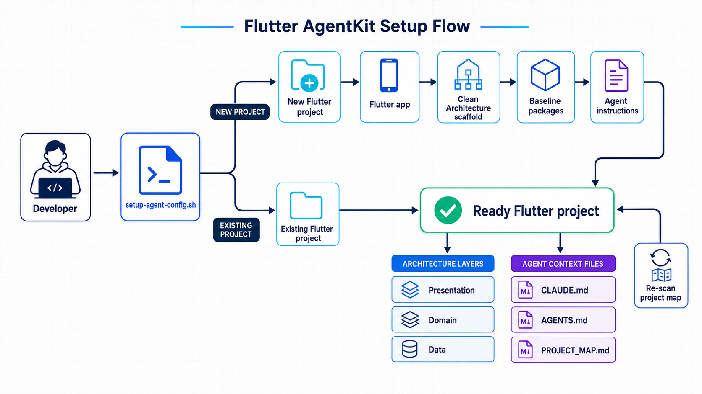

# Flutter AgentKit

Bootstrap a Flutter project with a feature-first Clean Architecture scaffold and
shared AI-agent instructions for Claude Code, Codex CLI, Cursor, and Windsurf.

<p align="center">
  <a href="https://www.tiktok.com/@hieu.modoro">TikTok · @hieu.modoro</a>
</p>

<p align="center">
  
</p>

## Why Flutter AgentKit?

Starting a Flutter app often means repeating the same setup work: create the
project, organise the feature layers, add foundational packages, and explain
the project's conventions to every coding agent. Flutter AgentKit puts that
baseline behind one Bash script.

- **Create a new app** with a working Provider, go_router, Dio, Hive, dartz,
  and shared_preferences baseline.
- **Configure an existing app** without restructuring its source tree.
- **Generate agent context** for Claude Code, Codex CLI, Cursor, and Windsurf.
- **Keep project context current** with a filesystem-derived `PROJECT_MAP.md`.
- **Detect recurring regression risks** with a generated `PROJECT_RISKS.md`
  covering ownership, async cleanup, schema/rules parity, idempotency, tests,
  mobile insets, direct client construction, and large-file hotspots.

## Requirements

- Bash 4 or newer
- Flutter SDK on your `PATH` when using `--new`
- A Flutter project containing `pubspec.yaml` and `lib/` when using
  `--existing`

## Quick start

Clone the repository, then run the setup script from its root.

```bash
git clone https://github.com/nguyentrunghieutcu/flutter-agentkit-setup.git
cd flutter-agentkit-setup
```

### Create a new Flutter project

```bash
bash setup-agent-config.sh --new my_app
```

Set a parent directory and Android/iOS organisation identifier when needed:

```bash
bash setup-agent-config.sh \
  --new my_app \
  --path ~/Projects \
  --org com.mycompany
```

The script runs `flutter create`, installs the baseline dependencies, creates
the architecture scaffold, and writes the agent configuration.

### Configure an existing Flutter project

```bash
bash setup-agent-config.sh --existing /path/to/flutter-project
```

This path leaves application source files in place. It only creates or updates
the agent configuration and project map.

### Use the interactive menu

```bash
bash setup-agent-config.sh
```

Choose whether to create a new Flutter project or configure an existing one.

## What gets generated

For a new project, AgentKit creates this feature-first structure:

```text
lib/
├── app.dart
├── main.dart
├── core/
│   ├── constants/
│   ├── error/
│   ├── network/
│   ├── router/
│   ├── theme/
│   └── utils/
├── features/
│   └── home/
│       ├── data/
│       ├── domain/
│       └── presentation/
└── shared/
    ├── providers/
    └── widgets/
```

It also adds the following configuration to new and existing projects:

```text
your-project/
├── CLAUDE.md
├── AGENTS.md
├── lib/AGENTS.md
├── .claude/
│   ├── PROJECT_MAP.md
│   ├── PROJECT_RISKS.md
│   ├── rules/
│   ├── reference/
│   ├── context/
│   ├── prompts/
│   ├── snippets/
│   ├── agents/
│   ├── memory/
│   └── skills/{scan-project,verify-project}/
├── .agents/skills/{scan-project,verify-project}/
└── .codex/
    ├── agents/code-reviewer.toml
    └── skills/{scan-project,verify-project}/  # legacy compatibility
```

`PROJECT_MAP.md` is generated from the real filesystem and `pubspec.yaml`; it
is not an agent-authored guess about the codebase. The map also inventories
backend surfaces, Flutter tests, and large Dart files that deserve extra care.

`PROJECT_RISKS.md` is generated by the bundled recurring-risk detector. It
separates deterministic project-rule violations (verification failures) from
heuristic architecture/test warnings (review required, but not automatically a
defect). Setup runs the detector once, and `verify-project` refreshes it before
formatting, analysis, and tests.

## Architecture

The generated application follows a feature-first Clean Architecture layout.

| Layer | Responsibilities | Dependency rule |
| --- | --- | --- |
| Presentation | Flutter UI, Providers, screens, and widgets | Calls use cases and repository abstractions |
| Domain | Entities, repository interfaces, and pure-Dart use cases | Does not import Data or Presentation |
| Data | Sources, models, and repository implementations | May import Domain; never Presentation |

Each feature owns its three layers in `lib/features/<feature>/`. Shared,
non-feature infrastructure belongs in `lib/core/`.

## Command reference

| Command or option | Description |
| --- | --- |
| `bash setup-agent-config.sh` | Starts the interactive project-type menu |
| `--new [name]` | Creates a Flutter project and Clean Architecture scaffold |
| `--existing [path]` | Adds agent configuration to a Flutter project |
| `--path <path>` | Sets the parent directory for a new project or target path for an existing project |
| `--org <domain>` | Sets the organisation passed to `flutter create` (default: `com.example`) |
| `--skip-deps` | Skips baseline dependency installation for a new project |
| `--force` | Refreshes managed instructions while preserving project-owned context/reference files |
| `-h`, `--help` | Shows the command help |

Refresh only the risk report:

```bash
bash .agents/skills/verify-project/scripts/detect-recurring-risks.sh
```

For example, create the scaffold but install the packages yourself later:

```bash
bash setup-agent-config.sh --new my_app --skip-deps
```

## Keep the project map current

After moving or creating source files, regenerate the map in the target Flutter
project:

```bash
bash .claude/skills/scan-project/scan.sh
```

Before finishing a change, run the safe validation workflow:

```bash
bash .agents/skills/verify-project/scripts/verify.sh
```

It checks formatting, `flutter analyze`, Flutter tests when present, and
existing Node backend `check` scripts without deploying or auto-fixing code.

Use the following command when you deliberately want to refresh existing
AgentKit-managed instructions. Project-owned files under `.claude/context/`
and `.claude/reference/` are preserved:

```bash
bash setup-agent-config.sh --existing . --force
```

## Documentation

- [Detailed setup guide](README-setup.md)
- [Badminton Smash agent setup audit](AGENT_SETUP_AUDIT.md)
- [Generated app architecture reference](example/docs/architecture.md)
- [Working generated Flutter example](example/)

## Contributing

Please read the [contribution guide](CONTRIBUTING.md) for the development
workflow, required checks, and pull request checklist.

## License

Distributed under the [MIT License](LICENSE).
